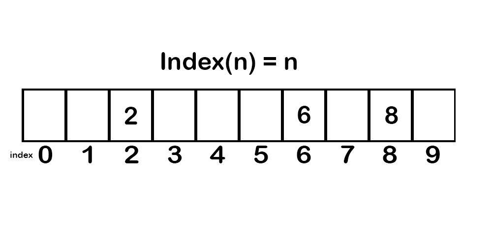
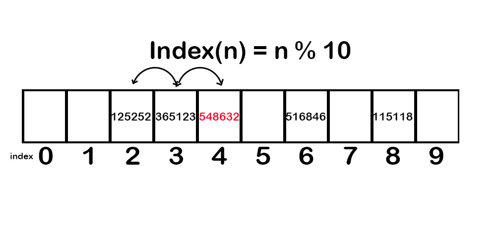
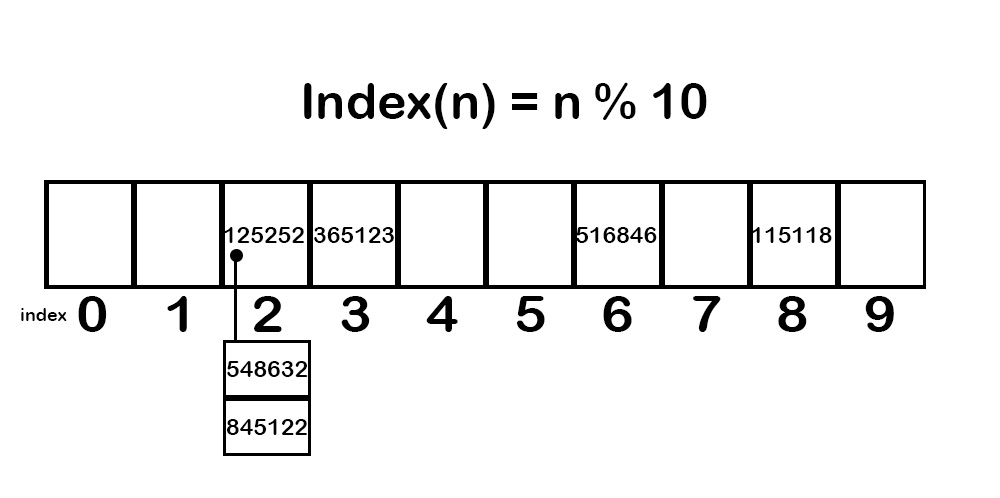

# Sets

In short, a **Set** is an unordered data structure that uses hashing to add, remove and test unique data. Unlike stacks, lists, and queues the location of each item within a set does not matter. Also, unlike stacks, lists, and queues a set does not allow duplicates. Because order does not matter, and duplicates are not allowed this allows us to efficiently find data within the set. We can manipulate the data within a set using a term called **hashing**, mentioned above. Hashing allows us to add, remove and test items within the set in O(1) time. 

To better explain sets let us look at a simple example. Suppose we wanted to store 10 items into a list. These items can be labeled as positive numbers from (0 to 9). We want to be able to add, remove, and test items in this list with an O(1) efficiency, how would we do this? If we assigned each item number to its matching index then we should be able to achieve O(1) efficiency. In python that would look something like this **`index(n) = n`**. This means that if we added the number 6, then this function would put the number 6 as index 6. Add the number 8 and the function would put number 8 as index 8, 2 equals index 2, etc. Eventually we would fill up the entire list with the exact number of items that we were expecting. That means for this to work correctly, the list needs to be the exact size in relation to the amount of data we are planning to enter into it. Because the list is the exact size that we need, this prevents duplicate data from entering it. 



Notice how the example above is populated. Unlike a normal list which is filled in from left to right, this list is filled in according to the index that we choose to enter. Because the list above is not filled in from left to right it is known instead as a **sparse list**. Because we connect each value to a specific index, we can use our existing formula to find any number more efficiently in the list. This search method results in O(1) efficiency. 

Our current formula works great if you have smaller lists, such as the one we used in our example. However, what would happen if instead we had a sparse list with 1 billion items? Although our current method would still work, performance would most likely struggle, and the amount of storage needed would be prohibitive. In this situation it would be ideal to take the large list and make it smaller. We can do this by using the modulo (%) operator. If we take our current formula and implement the modulo, we will get something like this, `index(n) = n % 10`. Now instead of the value 500,001 being held in the index(500,001), instead we would see index(500,001) = 500,001 % 10 = 1. The number 500,001 is now being held in index(1) instead of index(500,001). This dramatically decreases the size of our sparse list. 

Our new equation can now be further generalized into `index(n) = n % sparse_list_size`. This equation works great with numbers but with a slight adjustment we can also use it with floats and strings. The modified float/string equation is `index(n) = hash(n) % sparse_list_size`. The hash represents a **hashing function**. A hashing function converts non-integers into integers. A "hash" needs to be a singular index, for example a list cannot be hashed. 

## Conflicts
<hr>

What happens when multiple values try to occupy the same index on our sparse list? The result is a conflict. There are two ways to deal with conflicts. One way is to use **open addressing** and another way is to use **chaining**.

### Open Addressing

Open addressing fixes a conflict by shifting the conflicted value over until it reaches an empty index. The value is no longer conflicted and now equals that index. 



Open addressing, although it fixes the problem, should be used carefully because it can create more conflicts within the set. In our example above we see that multiple values were attempting to occupy the 2nd index resulting in a conflict. The conflicted value was then shifted to the right until it stopped in the 4th index. The issue here is that now if any other value would have originally been placed in the 4th index, instead it will create another conflict and be shifted to the 5th index. That could result in another conflict if a value were going to enter the 5th index, and so forth. 

### Chaining

Chaining fixes a conflict by creating a list of values that occupy the same space. This solution gets rid of the problem with open addressing where there was a chance of multiple conflicts. 



With both solutions we run the risk of worsening our efficiency. The index(n) hashing function is what allows our program to run with O(1) efficiency. If too many steps are added onto the searching process, then we could possibly reach O(n) efficiency. To help avoid this whenever you are encountering many conflicts you may need to increase the size of your sparse list.

## Common Set Operations
<hr>

Here are a couple of things to remember when using a set in Python. An empty set can be created by using the code `empty_set = set()`. A set is represented by the curly braces (e.g., `set = {1,2,3}`) You can use `in` to find items in the set. The efficiency of a set is determined by the hashing function. 

This table shows common operators that can be used with a set. The performance column is assuming that the code is run with a good conflict resolution. 

Common Set Operation | Description | Python Code | Performance
------------- | ------------- | ------------- | -------------
add(value) | Adds "value" to the set | `set.add(value)` | O(1) Performance
remove(value) | Removes the "value" from the set | `set.remove(value)` | O(1) Performance
member(value) | Determines if "value" is in the set | `if value in set:` | O(1) Performance
size() | Returns the number of items in the set | `length = len(set)` | O(1) Performance


There are also mathematical operations to perform an intersection, union, and differences abilities. These will be shown in the code below. 

### Uses for sets:

* Add and remove values efficiently 
* Membership testing
* Performing common set operations like unions, intersections, and differences
* Objects are mutable
* Can store the same or different types of objects
* Insertion is unordered 

## Set Examples
<hr>

### Creating a set

```python
#Creating an empty set
set = set()
print(set)
print(type(set))

#Creating a normal set
set = {1,2,3,4}
print(set)
print(type(set))

#Creating a set with different types
set = {1, "dog", 2, "cats", 3.54}
print(set)
print(type(set))

#Creating a set using range
set = set(range(10))
print(set)
print(type(set))

# Output:
#     #Empty Set
#     set()
#     <class 'set'>

#     #Normal Set
#     {1, 2, 3, 4}
#     <class 'set'>

#     #Different Types
#     {1, 2, 3.54, 'dog', 'cats'}
#     <class 'set'>

#     #Using Range
#     {0, 1, 2, 3, 4, 5, 6, 7, 8, 9}
#     <class 'set'>
```


It is important to note that the order of the set is not preserved. The order of the items is not the same in the input and the output. 

### Mathematical Operations and Sets

```python
#Using Intersection()
x = {1,2,3,4,5,6}
y = {4,5,6,7,8,9}
print(x.intersection(y))
print(x&y)

#Using Union()
x = {1,2,3,4,5,6}
y = {4,5,6,7,8,9}
print(x.union(y))

#Using Difference()
x = {1,2,3,4,5,6}
y = {4,5,6,7,8,9}
print(x.difference(y))

# Output:
#     #Using Intersection()
#     {4, 5, 6}
#     {4, 5, 6}

#     #Using Union()
#     {1, 2, 3, 4, 5, 6, 7, 8, 9}

#     #Using Difference()
#     {1, 2, 3}
```


### Frozen Sets
```python
#Frozen set
letters = ("a", "b", "c", "d", "e", "f")
frozen_set = frozenset(letters)
print(frozen_set)
print(type(frozen_set))

# Output: 
#     frozenset({'d', 'b', 'f', 'a', 'e', 'c'})
#     <class 'frozenset'>
```

A frozen set is an immutable set. 

## Problem to Solve:
<hr>

Without using set operators or built-in functions. Create an intersection, and a union between two sets. Find both the union and intersection for each set below. Work on this problem for at least one hour before looking at the given solution. Use the data below for your two sets. 

    set1 = {1,2,3,4,5,6}
    set2 = {4,5,6,7,8,9}

    set1 = {1,3,5,7,9}
    set2 = {2,4,6,8,10}

Compare your code to the solution here: [Solution](set_solution.md)

Back to home: [main page](home_page.md)