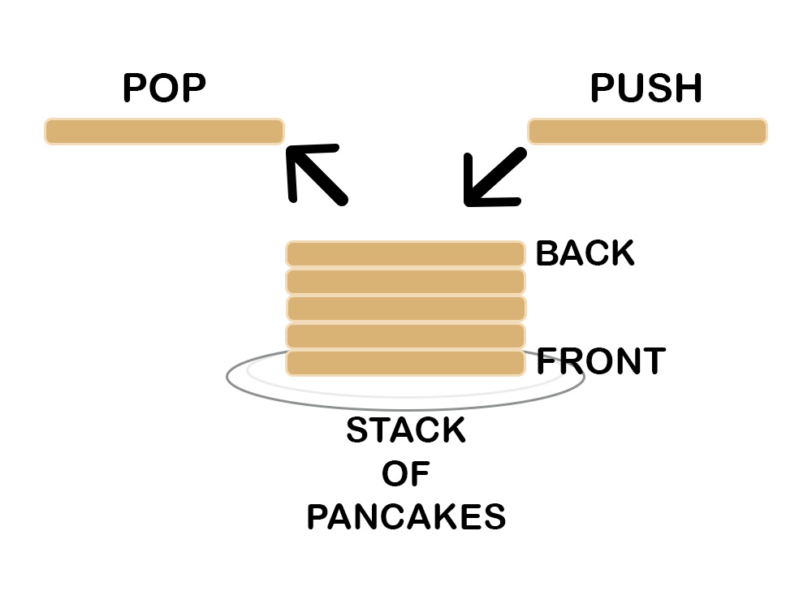
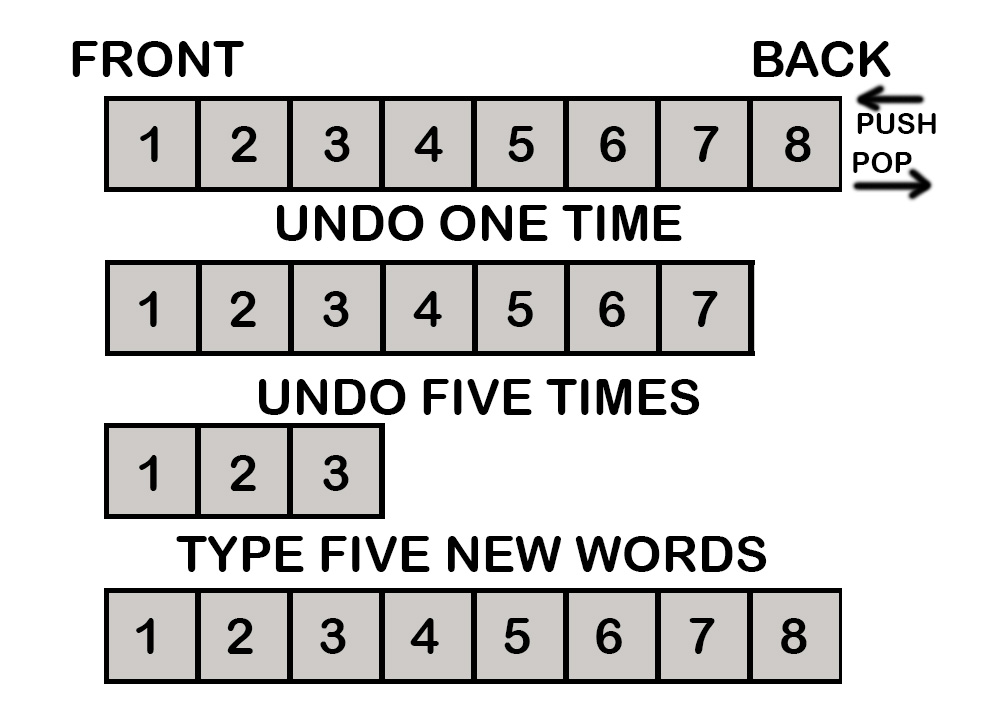

# Stacks

A **stack** is a linear data structure in which you add and remove items. This is implemented by using either a Python list or array. 
Also known as (LIFO) "Last in, First out" a stack inserts items to the end of the list, and removes items from the end of the list. 
The insert and remove operations are often called **`push`** and **`pop`**. 

A lot of people like to explain this data structure using a metaphor generally comparing it to a stack of pancakes or a stack of plates. 
Usually when making a stack of pancakes you stack each one on top of the other. Whenever you make a new pancake, you add it to the top 
of the stack (Or the back/end of the stack when referring to Python) and when someone grabs a pancake, they also take it from the top of the stack. 
It is generally not permitted to take a pancake from the middle or front of the stack. Keep in mind that this means the first pancake is at the front 
of the stack, the one touching the plate. If pancakes are added faster than people can grab them then every pancake that is not at the top could end up
sitting there for a while.



In Python the push and pop operators can be used by implementing `.append()` and `.pop()`. 
This table shows other common operators that can be used with a stack. 

Common Stack Operation | Description | Python Code | Performance 
------------ | ------------- | ------------- | ------------- 
push(value) | Adds "Value" to the back of the stack. | `stack.append(value)` | O(1) Performance
pop() | Removes an item from the back of the stack | `value = stack.pop()` | O(1) Performance
size() | Returns the size of the stack | `length = len(stack)` | O(1) Performance
empty() | Returns True if the stack is empty | `if len(stack) == 0`| O(1) Performance

### Uses for stack:

* Memory management
* String reversal
* Backtracking
* Undo features, the undo button in photoshop for example
* Using the forward and backward keys when on the web
* Used in many algorithms


## Undo and Stacks
<hr>
People use stacks all the time when working with programs on their computer. I mentioned a couple of ways a stack can be used. 
The most common use of a stack is related to the undo button. Every time you click the undo button in a program you are using a 
stack. In other words, stacks are wonderful at backtracking and are very applicable when working on most projects. 
<br>


Because the stack is maintaining a history of all the data that has been inputted, we know that when we click the undo button it will revert 
changes in the right direction. Meaning if we popped one time the result would be the numbers 1-7, and if we popped 5 times the result would 
be the numbers 1-3. If you keep pressing the undo button or keep popping items from the list, then eventually there will be nothing in the stack. 
Alternatively, if you push items into the list then the stack will continue to grow with each item pushed. 

Stacks are useful when a history is needed to perform an operation backwards. Stacks are used all the time when writing software. For example, every 
function we call uses a stack to keep track of which function we are currently using, and which function to go back to after we are done. 

## Stack Example:
<hr>

### Implementing Stack using Arrays 

```python
# Function to create an empty stack
def create_stack():
    stack = []
    return stack

# Checks to see if the stack is empty 
def is_empty(stack):
    return(len(stack) == 0)

# Function to push an item to the stack
def push(stack, item):
    stack.append(item)
    print(item + " has been pushed to the stack")

# Funtion to remove an item from the stack
def pop(stack):
    if(is_empty(stack)):
        return str(-1)

    return None

# Tests
stack = create_stack()
push(stack, str(1))
push(stack, str(2))
push(stack, str(3))
print(pop(stack) + " has been popped from stack")
print(f"The length of stack is {len(stack)} ") #Checks how many items are in stack

# Output:
#     1 has been pushed to the stack
#     2 has been pushed to the stack
#     3 has been pushed to the stack
#     3 has been popped from the stack
#     The length of stack is 2
```

Using each of the basic operations mentioned above we were able to add and remove items from a stack, check the size of the stack, 
and check to see if the stack is empty. 

## Problem to Solve: 
<hr>
Help someone create a list in which they can add and remove item, check the length of the list, and then close the application. 
The user needs to be able to add whatever they want to the list, and in any order, and they need to be able to remove the last 
added item if they choose to. The user also needs to be able to check how many items they have added to their list, and close 
out of the program when they choose to. 


Your solution must involve the use of a stack. It is recommended that you attempt to complete this problem for at least an hour 
before looking at the given solution. 

Compare your code to the solution here: [Solution](stack_solution.md)

Back to home: [main page](final_draft.md)