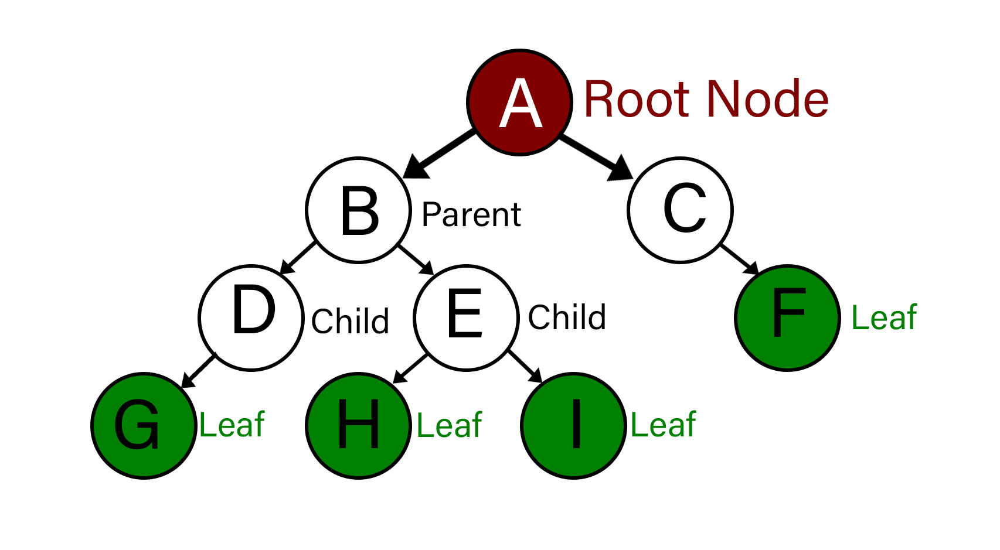
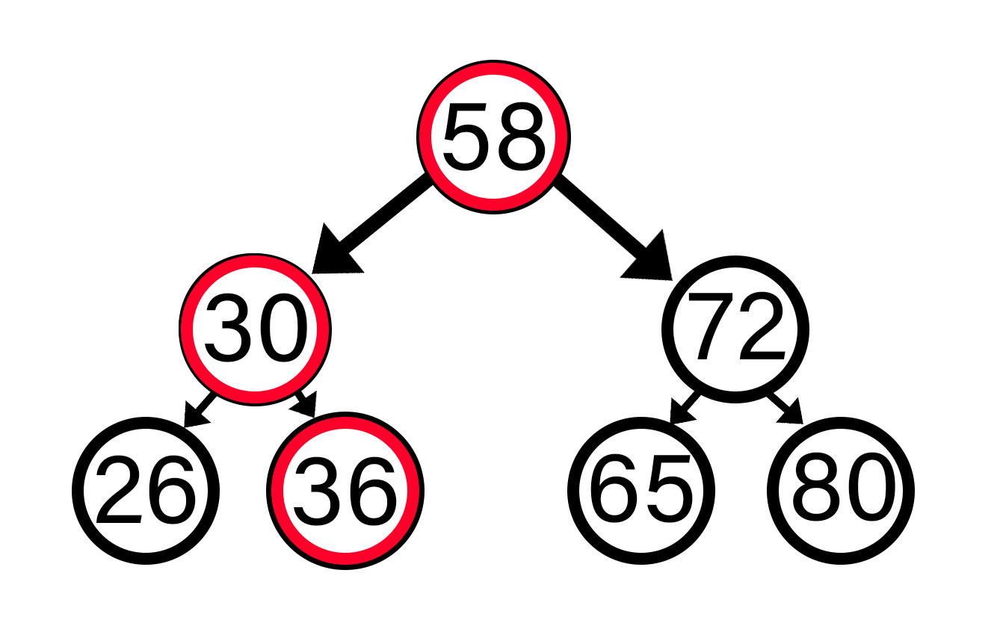
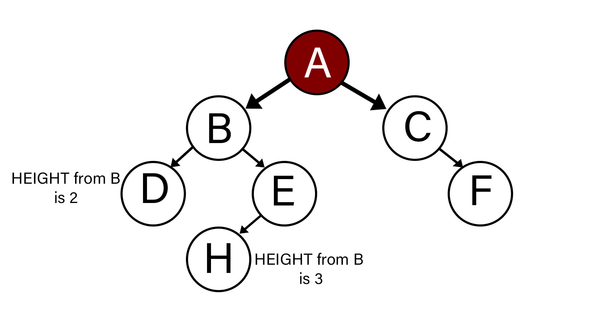
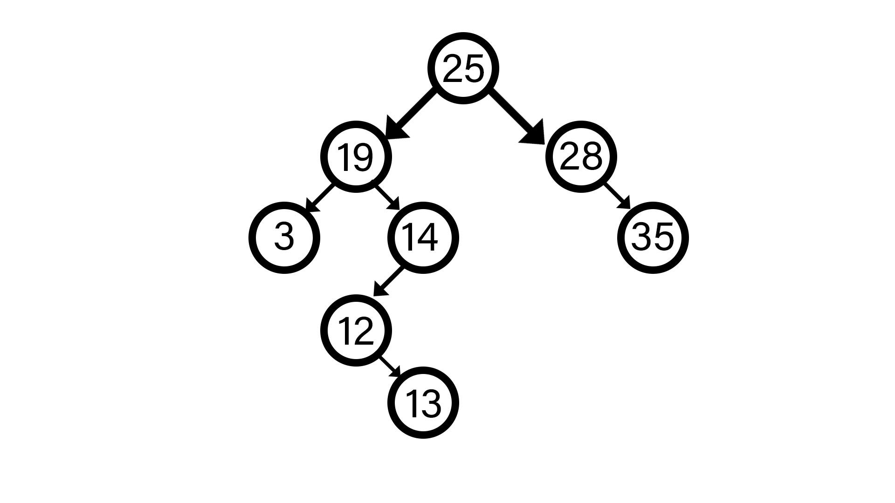
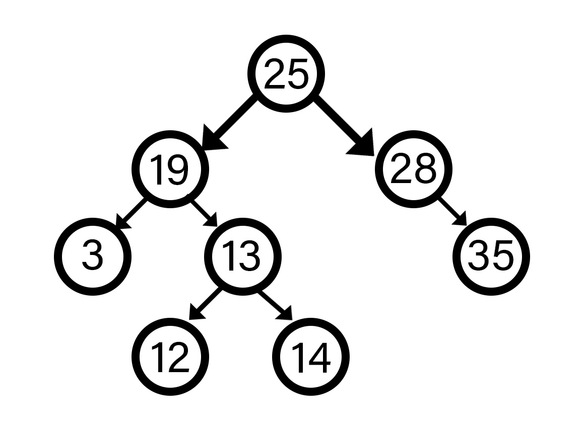

# Trees

A **Tree** is a non-linear data structure that consists of multiple nodes. Each node may be connected with more than one node, they are either directly or indirectly connected with edges (a fundamental part of a tree that shows if there is a relationship between two nodes). Each tree has a distinguished node, known as the "root node". 

## Types of Trees
<hr>

### Binary Tree
A **binary tree** is a tree that links to no more than two other nodes. The top node is called the **root node**, there is only ever one root node. Nodes that have connected nodes are called **parent nodes**. Nodes that are connected to a parent node are called **child nodes**. Nodes that do not connect to any other nodes are called **leaf nodes**. Usually, all nodes point to the next node, and vice versa. This means that just like parent nodes point to child nodes, the child nodes point back up to their parent node (like linked lists). The nodes that branch from a parent node form a **subtree**. In the example below the first subtree starts with parent node B. 



### Binary Search Trees
A **binary search tree (BST)** also known as a sorted or ordered tree, compares data with the value in the parent node, starting with the root node. If the data that is being compared is less than the parent node then it is put to the left. If the data that is being compared is more than the parent, then it is put to the right. This is how a binary search tree determines where to put items. 



The example above takes a value of 36 and inserts it into an existing BST. The steps it took to find its spot are as follows:
* Check the root node 58, compare with new value 36
* 58 is larger than 36, go to the left and check node with the value 30
* 36 is greater than 30, go to the right
* Empty node, fill with 36

A few things to note about the example above. 58 is the root node because it was the first value added to the tree. All the other values were placed using the same sorting algorithm as value 36, smaller values placed to the left and larger to the right. By using the BST, we exclude a subtree with every comparison. This means that we were able to split our search in half recursively. Therefore, the efficiency of our BST is O(log n). This is much more efficient than searching through the same set of data with a linked list or dynamic array. The efficiency using either a dynamic array or linked list would result in O(n) efficiency. However, our efficiency is O(log n) only because of how the data was entered into the tree, so what would happen if we took the same data and entered it in ascending order? 

The data would look very similar to a linked list (26, 30, 36, 58, 65, 72, 80). With the data sorted like this the efficiency would turn into O(n) because like a linked list we would have to search through every item in the tree before finding an open space. This is an unbalanced BST. 

### Balanced Binary Search Tree
A balanced binary search tree (balanced BST) is a BST in which no two subtrees are drastically different in height. Height in a BST is characterized as the distance between the maximum number of nodes between the root or parent and the leaves. If the distance between the parent and the leaves is greater than 2 then the tree is unbalanced. The parent is counted as 1. Multiple algorithms have been created to check if your tree is balanced or unbalanced. Two common algorithms are red black trees and AVL(Adelson-Velskii and Landis) trees. 



If one of the balancing algorithms you chose noticed the tree was unbalanced, then it would implement a **node rotation**. A node rotation is when we take the parent node that is unbalanced and switch its value with another value from the subtree. The value that is switched is determined by whichever value will even out the subtree. Below is an example of an unbalanced search tree.



To make this tree balanced, a node rotation will take place on the parent node 14. If 14 is rotated out for 13 then the tree will become balanced. It is important that your BST is balanced because it changes the efficiency from O(n) to O(log n). 



This balanced tree will run in O(log n) time. 

## Common Tree Operations
<hr>

This table shows common operators that can be used with a tree. The performance column is assuming that the code is run with a balanced tree. Python code examples will be provided below the table. 

Common BST Operation | Description | Performance
------------- | ------------- | -------------
insert(value) | Insert a value into the tree | O(log n)
remove(value) | Remove a value from the tree | O(log n)
contains(value) | Determine if a value is in the tree | O(log n)
traverse_forward | Visit all objects from smallest to largest | O(log n)
traverse_reverse | Visit all objects from largest to smallest | O(log n)
height(node) | Determine the height of a node. If the height of the tree is needed, the root node is provided | O(log n)
size() | Return the size of the BST | O(1)
empty | Returns true if the root node is empty | O(1)

### Uses for trees:

* Pathfinding in video games
* Rendering
* File Compression
* Compilers
* Databases

## Python Operations
<hr>


### BST Example:

```python
#Creating a constructor
class Node:
    def __init__(self, data=None):
        self.left = None
        self.right = None
        self.data = data

#Creating an insert function   
    def insert(self, data):
        if not self.data:
            self.data = data
            return

        if self.data == data:
            return

        if data < self.data:
            if self.left:
                self.left.insert(data)
                return
            self.left = Node(data)
            return

        if self.right:
            self.right.insert(data)
            return
        self.right = Node(data)

#Creating a delete function
    def delete(self, data):
        if self == None:
            return self
        if data < self.data:
            if self.left:
                self.left = self.left.delete(data)
            return self
        if data > self.data:
            if self.right:
                self.right = self.right.delete(data)
            return self
        if self.right == None:
            return self.left
        if self.left == None:
            return self.right
        min_value_node = self.right
        while min_value_node.left:
            min_value_node = min_value_node.left
        self.data = min_value_node.data
        self.right = self.right.delete(min_value_node.data)
        return self

#Print out the tree in the order of the values entered
    def order(self, values):
        if self.left is not None:
            self.left.order(values)
        if self.data is not None:
            values.append(self.data)
        if self.right is not None:
            self.right.order(values)
        return values
```

## Problem to Solve:
<hr>

Using the functions provided above add functions to get the max and min values within the tree. Add a function to see if a certain value exists within the tree and create a main function to run test cases for every function in the program. Your solution should be able to print your values in order from smallest to biggest, delete items, and find values in the tree excluding those that you deleted. Work on this problem for at least one hour before looking at the given solution.

Compare your code to the solution here: [Solution](tree_solution.md)

Back to home: [main page](home_page.md)